# Capestone-Project-Module-20-and-24

# Project on CNN (Deep Learning)

# Project Name - "CNN based Image Classification"

## Introduction 
Drone technology has witnessed rapid growth in recent years, finding applications in surveillance, delivery services, agriculture, and more. As drone usage continues to expand, ensuring safety and preventing unauthorized activities has become increasingly important. To address this concern, deep learning techniques can be applied to detect and localize drones in images. we will explore deep learning technique for image classification in the scope of this project.

**Project Overview: Object Classification for Drone Detection**

In this project, I aim to build a deep learning model for image classification to classify images containing various objects, specifically focusing on detecting drones, helicopters, airplanes, and birds. The dataset contains images of these objects, and the task is to develop a model capable of distinguishing between these categories.

The dataset used for this project is the Kaggle Drone Detection Dataset, which can be found at the following link

**Objective:**

The main objective of this project is to develop an image classification model capable of distinguishing between four different categories: drone, helicopter, airplane, and bird. By leveraging the Kaggle Drone Detection Dataset, we will apply Deep Neural Networks (DNNs) and Convolutional Neural Networks (CNNs) to classify the images. The performance of the model will be evaluated based on various metrics to determine its accuracy and make improvements as needed. We will build multiple models to compare and add improvement in result. To compare the finding and explore the data we will further use MobileNet2 to evaluation the performance of model build with different parameters.

# Source Dataset and Insights on data.
The dataset used for this project is the Kaggle Drone Detection Dataset, which can be found at the following [Link] (https://www.kaggle.com/datasets/cybersimar08/drone-detection/data?select=tensorflow+obj+detection+drone). 

This dataset contains images featuring different flying objects like drones, helicopters, airplanes, and birds. The images are labeled accordingly, and our goal is to train a model that can accurately classify these objects into their respective categories.

In each train, valid and image folder of the dataset we have annotation.csv file. We will explore that file from train to understand the data. 

## Key Steps in the Project:
    
### Data Understanding and Preprocessing: 
    
We will begin by exploring the dataset and organizing it for use in training the deep learning model. This includes preparing the images, resizing them, and splitting them into training, validation, and test sets.

Each image will be labeled with the respective object class (drone, helicopter, airplane, or bird), which will be used for supervised learning.

### Model Development: 

We will build a Convolutional Neural Network (CNN) for the image classification task. CNNs are well-suited for image data due to their ability to detect and learn patterns such as edges, textures, and shapes.

The model will consist of multiple convolutional layers to extract features from the images, followed by fully connected layers to classify them into one of the four categories: drone, helicopter, airplane, or bird. 

### Training the Model: 

We will train the CNN using the prepared dataset, utilizing deep learning frameworks like TensorFlow and Keras. During training, we will fine-tune hyperparameters such as learning rate, batch size, and the number of epochs to optimize the model's performance.

The training will involve using categorical cross-entropy loss and the softmax activation function for multi-class classification.

### Evaluation and Accuracy: 

After training, we will evaluate the model's performance on the validation and test datasets. Key evaluation metrics include accuracy, precision, recall, F1-score, and a confusion matrix to assess how well the model is performing at classifying each object.

The results will help determine the model's effectiveness at distinguishing between drones, helicopters, airplanes, and birds.

### Additional details and exploration:
We will first perform inital report and exploratory data analysis by creating a CNN model 
To extend the evaluation of the model we will create other model by setting hyper parameter and comparing the result. 
We will explore using pre-trained model like MobileNetV2 and compare the result. 

### Data Understanding and Preprocessing: 

**Understand the actual images, labels, sizes and its count** 

The dataset has already been divided into training, testing, and validation sets, with images stored in separate train, valid, and test folders. Each image is labeled according to its class. The data size is 190 MB.

We will perform data preprocessing on the dataset. The process are as follow:

>- we will use labels from the image filename to structure the data by organizing the images into corresponding directories for each class (such as drone, helicopter, airplane, bird) within the train, valid, and test folders.
>- Once the images are organized, we will plot the distribution of images across each class in the training data to gain insight into class balance.Identifying class imbalance is an easy first step. We’re going to find the number of images assigned to each class and plot them in a bar chart to easily identify any imbalance. Imbalance in a CNN could result in poor performance for the class with less representation, impacting overall performance.
>- we will visualize the pixel values of sample images from each class to better understand the image characteristics. 
 
 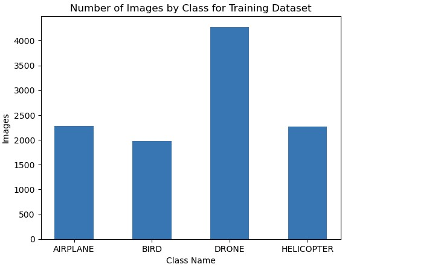
 
 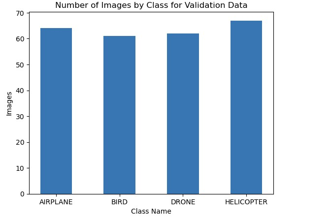
 
 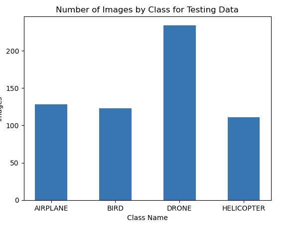

From the plot we can clearly see the class imbalancing in the training and testing dataset which could impact the image classifcation model but using techniques like resampling, class weights, data augmentation, focal loss, and appropriate evaluation metrics can significantly improve the model’s ability to handle imbalanced data.

Maintaining a consistent image size is essential in deep learning, as mismatched image dimensions can cause errors and halt the project. Ensuring uniformity in image size across the dataset is crucial for model compatibility and effective training. Additionally, visualizing the raw image sizes can provide valuable insights into the dataset, helping better understand its structure and any potential issues that may arise during preprocessing.

**Plot the original images pixel from some classes:

This plot gives clarity that all training dataset are of same pixel size. From the graph we find that the image pixel size is 640*640. Using large image pixels (e.g., 640x640) has its drawbacks, particularly in terms of memory usage, training time, and the risk of overfitting. It’s often a good practice to resize images to a smaller resolution. 

In the jupyter notebook we will find techniques like Data Augmentation is used on resized images to improve the model accuracy and performance. 

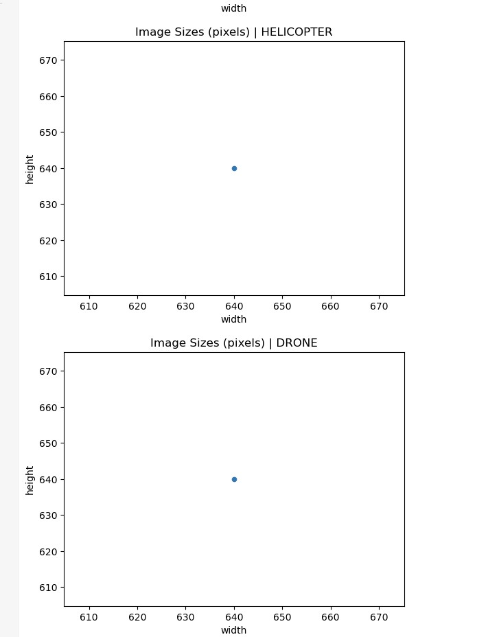

To have same format of data we will perform the image structuring and resizing for all train, valid and test datasets. 

**Understand the annotation dataset in the train folder.** 

Like we mentioned before, the dataset has annotation.csv in train, valid and test folder. We will explore teh dataset to understand the annotation data and analyse the data to decide if the annotation is matching with actual image files in each class.

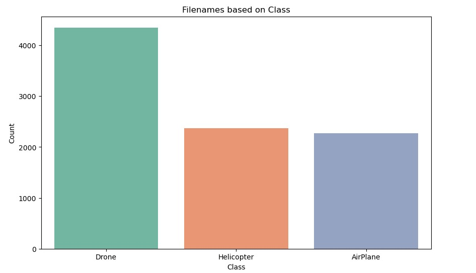

Upon reviewing the plot above, it is evident that the annotation data does not align with the actual files available in the train folder. Specifically, the Bird class appears to be missing in the annotations. This discrepancy suggests that the annotation.csv file contains incomplete information for the Bird class and is not fully reliable for image classification purposes moving forward

### Image Preprocessing:

To achieve image preprocessing at first images are resized to 256*256 pixel in the appropriate directories for each class. To verify the quality of the image we will plot the images in Grid view.

**View sample image after resizing in Grid**

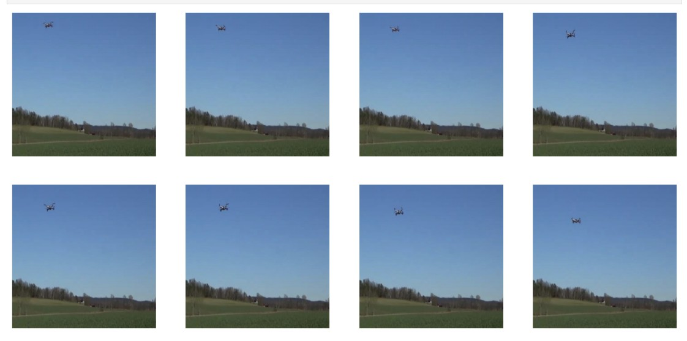

While this may not be critical for the model itself, getting familiar with the data is essential. The more we understand the dataset, the better equipped we will be to interpret model outputs. This insight will enable us to make informed iterations, leading to more intelligent adjustments and, ultimately, a more effective and refined model.

**Label Encoding**

Label encoding is an important step in the preprocessing pipeline for image classification, especially when the target labels are categorical (i.e., the images belong to different classes, such as  drone, helicopter, airplane, bird). Here's why label encoding is needed:
 - Label encoding transforms each unique label (class name) into a corresponding integer.
 - Label encoding guarantees that the model can correctly interpret the classes during both training and evaluation.
 - After label encoding, we can use one-hot encoding to represent each class as a vector of binary values.
 - Label encoding simplifies the process of using such loss functions, where each integer corresponds to a specific class.
 - Numeric encoding ensures that the model treats each class as a separate entity without imposing any unwanted ordering.

This is particularly important for neural networks, which expect numeric input rather than string labels.

In our case we will be applying label encoding using LabelEncoder from sklearn.preprocessing package to encode the training, validation and tetsing dataset. 

**Data Augmentation using ImageDataGenerator**

Data augmentation is a technique used to artificially expand the size of a training dataset by generating modified versions of the images in the dataset. ImageDataGenerator from Keras is a powerful tool for performing real-time data augmentation during training. It generates new images by applying random transformations such as rotations, flips, zooms, shifts, etc., to the original images, helping to improve the model’s performance.

In this project, we are using data augemtation on training dataset and only rescaling in testing and validation dataset to use in the first model we will be creating based on CNN architecture. 

### First Model Development: 
In this project we first created Convolutional Neural Network (CNN) using Keras' Sequential API. It’s designed for image classification, where the input is an image of shape (256, 256, 3) (256x256 pixels with 3 color channels).

Let's understand the model archietcture:

Use the function Sequential() to create a neural network model with the following architecture:

**Convolutional Layers (Conv2D):** These layers automatically extract important features (such as edges, textures, etc.) from the image. 
                                    
**Parameters:**

- 32: The number of filters (kernels). Each filter extracts different features (edges, textures, etc.) from the input image. The more filters, the more features the model learns, but it also increases the computational load.

- (3, 3): The size of the convolutional filter (3x3 pixels).

- activation='relu': The ReLU (Rectified Linear Unit) activation function is used here to introduce non-linearity. This helps the network learn more complex patterns.

- input_shape=(256, 256, 3): This defines the input shape of the image (256x256 pixels with 3 color channels—RGB). This is necessary only for the first layer.

**Max-Pooling Layers:** These layers down-sample the image to reduce the number of parameters, making the model less prone to overfitting.

**Parameters:**

- (2, 2): The size of the pooling window (2x2). The pooling operation selects the maximum value from each 2x2 region, downsampling the feature map by a factor of 2 in both dimensions (width and height).  

**Conv2D (2nd Convolutional Layer):** This is the second convolutional layer, which learns higher-level features of the image by using 64 filters (double the   number of filters from the first layer).
                                **Parameters:**
                                 
- 64: The number of filters.

- (3, 3): The filter size.

- activation='relu': Again, ReLU activation is used.

**MaxPooling2D (2nd Pooling Layer)** A second max pooling layer, similar to the previous one, further downsampling the feature map.

**Parameters:**

- This will reduce the dimensions of the image from 128x128 to 64x64 (if the input image was initially 256x256). 

**Flatten Layer** The flatten layer transforms the 2D feature maps (after convolution and pooling) into a 1D vector. This is necessary because fully connected (dense) layers expect a 1D input..

**Parameters:**

- Converts the multi-dimensional feature map into a single vector of features, which can be fed into the dense layer. 

**Fully Connected Layer (Dense):** After extracting features, the model uses fully connected layers to make the final predictions.
                        
**Parameters:**
                                 
- 128: The number of neurons in this layer. This means the network has 128 parameters that will be learned during training.

- activation='relu': Again, the ReLU activation function introduces non-linearity, allowing the model to learn complex patterns.

**Dropout Layer:** This regularization technique helps prevent overfitting by randomly setting a fraction of the input units to zero during training.
                                 
**Parameter:**

- 0.5: This means that 50% of the neurons in the previous layer will be randomly dropped during training. This helps prevent the model from memorizing the training data (overfitting).

**Softmax Output Layer:** The softmax function is used in the output layer for multi-class classification, producing a probability distribution over the    classes.

**Parameters:**

- len(label_encoder.classes_): The number of neurons in this layer corresponds to the number of unique classes in the dataset (for example, if there are 4 classes like "airplane", "bird", "drone", and "helicopter", this would be 4).

- activation='softmax': The softmax activation function is used for multi-class classification tasks. It converts the raw output scores of the network into a probability distribution over the classes. The output will be a vector of probabilities that sum to 1, where each value represents the probability of the input image belonging to each class.

### Complie First Model
This is the first model we are compiling using multi-class classification. We are using 'adam' optimizer and 'sparse_categorical_crossentropy' loss as parameter. sparse_categorical_crossentropy is a loss function used in multi-class classification problems, where each sample belongs to exactly one class out of many possible classes.

When dataset uses integer-encoded labels (i.e., labels are integer indices for the classes), sparse_categorical_crossentropy should be used.                                   

### Training First Model
Now, we can train the model using train_generator and valid_generator (created using Data Augmentation) that return integer-encoded labels. We will also use epochs, An epoch refers to one complete cycle through the entire training dataset during the training process of a model. In machine learning, when training a model, we pass the data through the network multiple times to optimize its weights and biases, helping the model learn to make better predictions.

we are training the model on Epoch value of 10. 

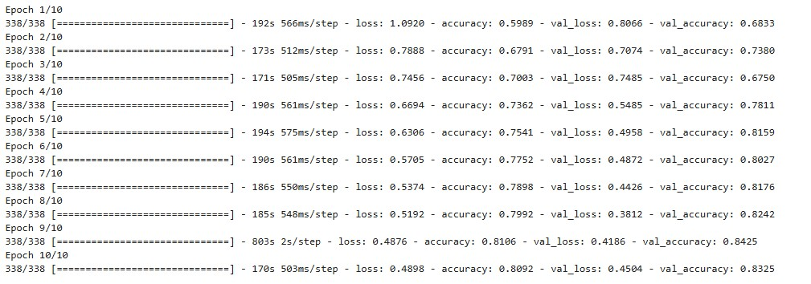

**Epoch number:** The first number (e.g., Epoch 1/10, Epoch 2/10) represents the current epoch and the total number of epochs. For example, Epoch 1/10 indicates that this is the first epoch out of 10 total epochs.

**Batch Progress:** The line starting with 338/338 indicates that the training process involves 338 batches per epoch, and it's reporting the progress through those batches. The numbers like 338/338 and the time per step (e.g., 566ms/step) indicate the completion of batches and the time taken per batch, respectively.

**Metrics:**

>- **Training Loss:** The loss metric shows how well the model is performing on the training data. Lower loss values indicate better performance. For instance, in Epoch 1, the loss was 1.0920, and by Epoch 10, the loss decreased to 0.4898, indicating the model is improving.

>- **Training Accuracy:** The accuracy metric measures the proportion of correct predictions made by the model on the training data. For example, in Epoch 1, the model had an accuracy of 59.89%, and it improved to 80.92% by Epoch 10.

**Validation Metrics:**

>- **Validation Loss:** The val_loss shows how well the model is performing on the validation set. A decrease in validation loss typically indicates better generalization. For instance, in Epoch 1, the validation loss was 0.8066, and it gradually decreased to 0.4504 by Epoch 10, meaning the model is generalizing better.

>- **Validation Accuracy:** The val_accuracy is the proportion of correct predictions on the validation data. The validation accuracy improved from 68.33% in Epoch 1 to 83.25% in Epoch 10, indicating that the model is not just overfitting but also improving its performance on unseen data.

**Key Observations:**

>- The training accuracy increases from 59.89% to 80.92% over 10 epochs, showing steady improvement in learning.

>- The validation accuracy also improves, starting from 68.33% and ending at 83.25%. This suggests that the model is not overfitting since the validation accuracy is increasing along with the training accuracy.

>- The training loss decreases from 1.0920 to 0.4898, indicating that the model is becoming better at minimizing the error on the training set.

>- The validation loss decreases from 0.8066 to 0.4504, which shows that the model is not only improving on the training data but is also performing well on the validation data.

**Conclusion:**

>- The model is learning progressively and generalizing well over time.

>- The training and validation accuracy both increase, and the loss decreases, suggesting that the model is improving in both training and validation phases.

>- The improvement in validation accuracy indicates that the model is not overfitting, which is a good sign of generalization capability.

### Evaluation and Accuracy of First Model:

After training a model, evaluating its performance on a separate dataset (such as the validation or test set) is essential to understand how well it generalizes to unseen data. Accuracy is one of the most commonly used metrics to evaluate classification models, but other metrics like precision, recall, and F1-score are also essential depending on the problem.

In this process we performed model evaluation and model prediction. It is key to understand the difference of model evaluation and model predictions. 

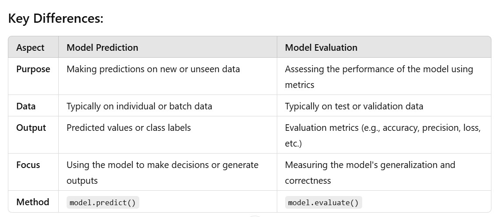

**Model Evaluation of First CNN model**

print(f"Test Accuracy: {model_first_test_accuracy:.2f}")
19/19 [==============================] - 3s 145ms/step - loss: 0.4482 - accuracy: 0.8523
Test Accuracy: 0.85

**Classification Report of Model Prediction**

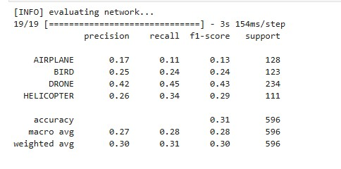

## Initial Report and Exploratory Data Analysis(EDA) Findings

The model's overall performance can be understood by looking at the two key outputs: the test accuracy and the classification report. Let’s break them down:

1. **Test Accuracy: 0.85**

This indicates that the model correctly classified 85.23% of the test images in the dataset. While 85% accuracy seems good at first glance, accuracy alone can be misleading, especially in imbalanced datasets or when the class distribution is uneven. In this case, we also need to examine the classification report to get a clearer picture of the model's performance across individual classes.

2. **Classification Report Explaination**

The classification report gives us a detailed breakdown of the model's performance across individual classes (AIRPLANE, BIRD, DRONE, HELICOPTER). It shows four important metrics: precision, recall, f1-score, and support. Let’s go over each of these metrics and understand the model's behavior.

- Precision:

Precision tells us how many of the instances the model predicted as a certain class were actually that class. For example:

>- AIRPLANE Precision = 0.17, meaning only 17% of the images predicted as AIRPLANE were actually AIRPLANE. This is quite low.

>- DRONE Precision = 0.42, which means 42% of the images predicted as DRONE were actually DRONE.

- Recall

>- Recall tells us how many of the actual instances of a class were correctly identified by the model. For example:

>- AIRPLANE Recall = 0.11, which means the model correctly identified only 11% of actual AIRPLANE images.

>- DRONE Recall = 0.45, meaning the model correctly identified 45% of actual DRONE images.

>- HELICOPTER Recall = 0.34, meaning it correctly identified 34% of HELICOPTER images.

- F1-Score

>- The F1-score is the harmonic mean of precision and recall. It is useful when we need a balance between precision and recall:

>- AIRPLANE F1-score = 0.13, which is very low, indicating poor performance on predicting AIRPLANE images.

>- DRONE F1-score = 0.43, which is higher than others, but still below the ideal score of 1.0.

>- HELICOPTER F1-score = 0.29, which also reflects poor performance in predicting HELICOPTER images.

- Support
    
>- Support refers to the number of actual instances of each class in the dataset:

>- AIRPLANE has 128 images, BIRD has 123, DRONE has 234, and HELICOPTER has 111.

These numbers tell us the distribution of images in the test set. DRONE has the most instances, while HELICOPTER has the least.

3. **Key Insights from the Report:**

Accuracy of 0.31 in the classification report suggests that while the model's overall accuracy was 85%, its performance is actually poor when broken down by class. This discrepancy could be due to class imbalance or poor model generalization.

The model struggles significantly with AIRPLANE, BIRD, and HELICOPTER classes, as reflected by the very low precision and recall for these classes.

DRONE seems to be the class the model performs the best on, but the precision and recall are still relatively low (42% and 45%, respectively). This indicates that while the model is identifying DRONE images, it still makes many mistakes.

HELICOPTER also has a relatively low F1-score, indicating that the model is not performing well in identifying HELICOPTER images either.

4. **Suggestions for Improvement:**

- Class Imbalance: The model seems to have a class imbalance problem. DRONE is likely overrepresented, and the model may have learned to predict it more easily. Consider using techniques like class weighting, oversampling, or undersampling to address this issue.

- Further Training: The model may require more epochs of training, better data augmentation, or fine-tuning of the hyperparameters.

- Model Architecture: Consider using more sophisticated architectures, such as pre-trained models like MobileNetV2, ResNet, or Inception, which could help improve feature extraction and overall classification.

- Cross-Validation: Implementing cross-validation to better assess the model’s performance and avoid overfitting could lead to better generalization.

5. Conclusion:

While the model achieves decent overall accuracy (85%), it has issues with class imbalance and the performance is poor on certain classes like AIRPLANE, BIRD, and HELICOPTER. The low precision, recall, and F1-scores for these classes suggest that improvements are needed in model training and handling class imbalance to increase accuracy across all classes.

## Additional Exploration to handle the improvement suggested:

In the scope of this project I explore some more models to compare the performance. We will notice improvement in the first model by using more advance hyper parameter. For learning and exploration of the dataset I tried MobileNetV2 and we will understand the result, performance and improvement of it. Let's proceed..

### Create Second CNN Model

We will now define the second CNN model for this project. The model architecture is same and number of layers are same. The key change in the second model is adding hyperparameters. hyperparameters are the settings or configurations that we define before training the model. These hyperparameters directly influence the performance of the model, and finding the right set of hyperparameters is crucial to obtaining good results. Hyperparameters are different from the model parameters (such as weights and biases), which are learned during training. We are using 'adamx' optimizer, 'categorical_crossentropy' loss. We are further prprocessing the image using normalization. and learning_rate while compiling the model to improve the performance of the model.

The learning rate determines how much the weights of the model are adjusted with respect to the loss function after each update.
Optimizers are algorithms used to update the model weights based on the loss function.
Normalization helps to accelerate the convergence of the model during training and ensures that the model is trained on data in a consistent format.

### Compile Second CNN Model

Categorical Cross-Entropy is a loss function commonly used for multi-class classification tasks, where the goal is to assign an image or input to one of multiple possible classes. It's widely used in image classification problems where the target labels are one-hot encoded (i.e., each label is represented as a vector where only one position is 1, corresponding to the correct class, and all others are 0). Admax is a newer optimization algorithm designed to combine the benefits of Adam and AMSGrad.

AdamX is an extension of the Adam optimization algorithm, which is widely used in deep learning for its adaptive learning rate capabilities. Adam (short for Adaptive Moment Estimation) combines the benefits of both AdaGrad and RMSprop, adapting the learning rate based on the first and second moments (mean and variance) of the gradients.

AdamX vs Adam
Adam is a widely used and reliable optimizer, but it can sometimes be inefficient in some contexts, such as sparse data or problems with noisy gradients.

AdamX builds on Adam's core strengths but includes additional mechanisms to better handle specific challenges, like reducing overfitting or managing noisy gradients in complex models.

**We added additional Data preprocessing using custom DataGenerator class()**

Here we created custom DataGenerator. which is designed to be used with Keras or TensorFlow’s fit() function, especially when we have a large dataset that doesn’t fit entirely into memory. It is a subclass of Sequence, which is a base class provided by Keras for writing data generators. The purpose of the DataGenerator class is to load and yield batches of data (images and their corresponding labels) for training.

Custom generators are used when we need highly specialized functionality that is not supported by the built-in ImageDataGenerator. It is flexible as we need it to be. We can load data from any source (e.g., files, in-memory data, or even external databases), perform custom data augmentation, and even change how batches are constructed

In the previous model we used ImageDataGenerator for data preprocessing. Let's look at the key difference between both.
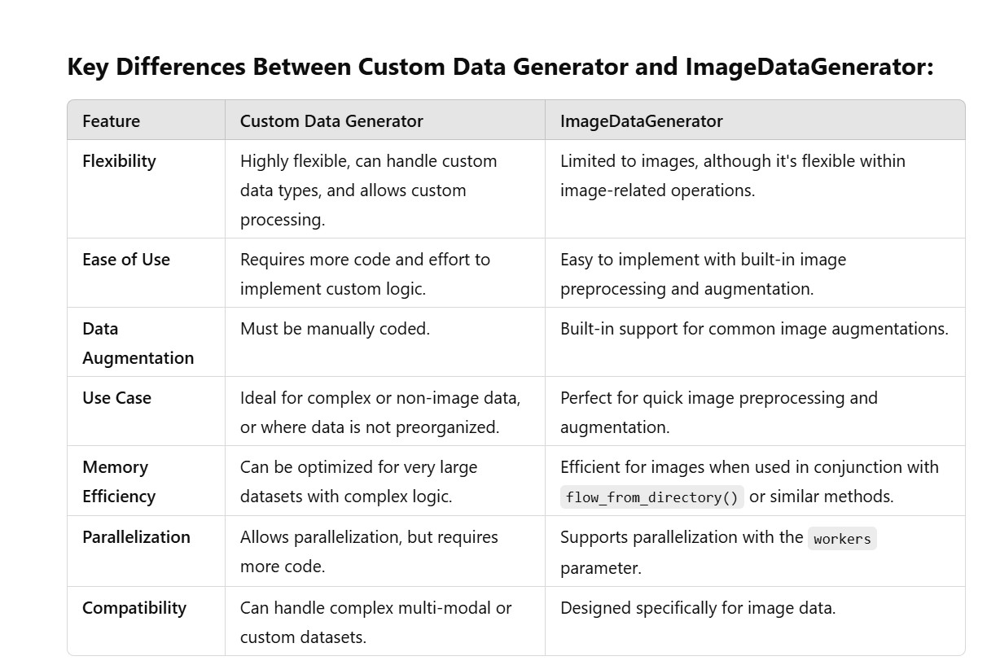

### Training Second CNN Model

Now we will tarin the second model using the traina and validation data generated using DataGenerator. We will increase the Epoch time as well.. 
This time we use Epoch value as 15. 

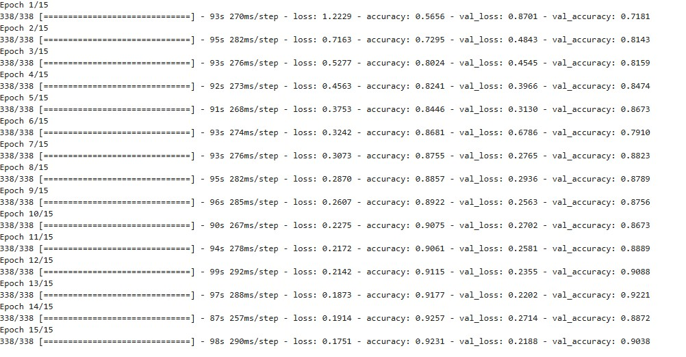

This is the training log of a deep learning model, typically a neural network, during its training process over 15 epochs. The log includes information about the loss and accuracy of the model during training and validation phases at each epoch.

**General Observations from the Log:**

**Training Performance:**

As the epochs progress, the training loss decreases, which means the model is improving its predictions on the training data. For example, from 1.2229 in Epoch 1, it decreased to 0.1751 in Epoch 15.

The training accuracy increases steadily from 56.56% in Epoch 1 to 92.31% in Epoch 15. This suggests that the model is learning and improving its ability to classify the training data.

**Validation Performance:**

The validation loss fluctuates, with a slight overall downward trend. For example, in Epoch 2, the val_loss dropped to 0.4843 and in Epoch 6, it spiked to 0.6786. However, it eventually decreases again, and by Epoch 15, the val_loss is 0.2188, which is much lower than the initial value.

The validation accuracy generally improves throughout the epochs, with some fluctuations. In Epoch 1, the val_accuracy is 71.81%, and by Epoch 15, it is 90.38%, indicating that the model is not only fitting the training data well but is also generalizing to the validation data effectively.

**Overfitting:**

There is a potential risk of overfitting if the training accuracy becomes much higher than the validation accuracy over time. In this log, the training accuracy increases while the validation accuracy also increases, indicating that the model is improving in a balanced way.

Although the validation accuracy fluctuates, it doesn't dramatically decrease after an improvement, suggesting that overfitting is not a major issue.

**Learning Curve:**

>- The model seems to follow a typical learning curve:

>- Early epochs show rapid improvements in loss and accuracy.

>- After several epochs, the rate of improvement slows down, as seen in the later epochs where changes in loss and accuracy become smaller.

>- This behavior is common in deep learning models as they converge towards an optimal state.

### Summary of Second Model Performance:

**Epoch 1:**

- Training Loss: 1.2229

- Training Accuracy: 56.56%

- Validation Loss: 0.8701

- Validation Accuracy: 71.81%

**Epoch 15:**

- Training Loss: 0.1751

- Training Accuracy: 92.31%

- Validation Loss: 0.2188

- Validation Accuracy: 90.38%

This shows that the model improved steadily throughout the training process, with both training and validation performance increasing. It is a good sign that the model is learning, generalizing well, and not overfitting.

### Evaluation and Accuracy of Second Model

Because the model was trained on normalized data so before model evaluation we will normalizsed the test data and evaluate the model performance. 

19/19 [==============================] - 1s 65ms/step - loss: 0.1826 - accuracy: 0.9144
Test Accuracy: 0.91

The model performed well on the test data, with a relatively low loss of 0.1826 and a high accuracy of 91.44%.
The 91% test accuracy is a strong indicator that the model has learned effectively and is able to generalize well to unseen data.
The time per batch (65ms) is also efficient, suggesting that the model is processing the test data quickly.
In summary, the model seems to be doing well in terms of both performance (accuracy) and efficiency (time per step).

Like we did in first model, we will also like to view classifcation report on second model prediction and see the details. 

**Classification Report of Model Prediction**

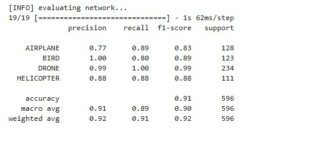

**Overall Performance Explanation:**

- The model has performed well with a 91% accuracy, which indicates that it is correctly classifying most images in the test dataset.

- Precision and Recall are good for all classes, especially for DRONE, where the precision and recall are very high (close to 1), indicating that the model is very good at classifying drones.

- The F1-scores across the board are balanced, showing that the model is doing well in both precision and recall for each class.

- The macro average indicates that, on average, the model is performing similarly across all classes.

- The weighted average takes the class imbalances into account (since some classes like DRONE have more images), and it shows that the model is still performing well overall, with high precision and recall.

**Conclusion:**

The model is performing well across all classes, with particularly strong performance for the DRONE class. The model is not perfect (e.g., precision and recall for BIRD and HELICOPTER could be improved), but overall, the results indicate that the model is generalizing well to the test data.

## Explore Third model using MobileNetV2. 

MobileNetV2 is a powerful, efficient, and lightweight model, ideal for image classification tasks where computational resources are constrained, such as on mobile devices, embedded systems, and real-time applications. It provides a great balance between accuracy, speed, and resource usage, making it suitable for both research and production environments. Its efficiency makes it a popular choice for modern image classification tasks, especially when working with limited hardware or requiring real-time performance.

Becasuse the data we used is computer vision data so we like to explore using MobileNetV2. 

We will first prepare the data and for that we will first try to convert the data in numpy array and set the training and testing in define dimension to use it model training and evaluation. 

**Data Preparation**

Setting the training images to the 224x224 dimension for MobileNetV2 is necessary to ensure:

- Compatibility with the model's architecture (which expects this specific input size).

- Proper utilization of pre-trained weights.

- Computational efficiency.

- Consistency and reliable model performance across training and inference.

The dimension we set for the training and testing dataset is 224*224*3. The dimensions 224x224 pixels with 3 color channels (RGB), is the standard input size for MobileNetV2 and many other pre-trained models.

### Model development and understand the architecture. 

Let's understand the Model architecture. 

1. Base Model (MobileNetV2)

- MobileNetV2 is used as a feature extractor. It is a pre-trained model that has been trained on a large dataset (e.g., ImageNet), but here, the top layers (classification layers) are excluded (include_top=False), allowing us to use its feature extraction capabilities.

- input_tensor=Input(shape=input_shape) specifies the input shape for the model. The model expects input images with the given shape (e.g., (224, 224, 3) for color images of size 224x224).

- The MobileNetV2 model has learned rich feature representations from a large dataset, which will be fine-tuned for the new dataset through transfer learning.

2. Freezing Layers

- This loop freezes all the layers in the base model except for the last 4 layers. The frozen layers are not updated during training, which reduces training time and prevents overfitting, especially when we don’t have a large dataset.

- This helps the model retain the features learned from the original dataset (like ImageNet), and only the last layers (which are more specific to our task) will be fine-tuned.

3. Sequential Model

- This creates a Sequential model, where layers are stacked one after the other. Each layer takes the output of the previous layer as its input.

4. Base Model (MobileNetV2) as Feature Extractor

- The MobileNetV2 base model is added to the new model. It will extract feature maps from the input image, producing high-level features (e.g., edges, textures, patterns).

5. Average Pooling Layer

- This AveragePooling2D layer reduces the spatial dimensions of the feature map produced by MobileNetV2. By applying a 2x2 pooling operation, it reduces the height and width of the feature map by half, retaining the important features while reducing the computational load.

6. Flatten Layer

- The Flatten layer converts the 2D feature maps into a 1D vector. This step is necessary because the following fully connected layers expect 1D input.

7. Fully Connected Layer (Dense Layer)

A Dense (fully connected) layer with 512 units is added. This layer learns high-level combinations of features extracted by the MobileNetV2 base model.

ReLU activation function is applied here to introduce non-linearity, allowing the model to learn more complex patterns.

8. Dropout Layer

The Dropout layer with a dropout rate of 50% is added to reduce overfitting. It randomly drops half of the neurons during each training step, forcing the network to learn more robust features and reducing reliance on any single neuron.

9. Second Fully Connected Layer

- Another Dense layer with 50 units and ReLU activation is added. This further refines the features learned by the previous dense layer.

- The number of units in this layer is smaller, which can help to learn more compact representations.

10. Dropout Layer

A second Dropout layer with a 50% rate is added again to prevent overfitting and to further regularize the model.

11. Output Layer

- The final Dense layer is the output layer. The number of units is equal to class_number, which is the number of categories in the classification task.

- The Softmax activation function is used here because the model is performing multi-class classification. It produces probabilities for each class, ensuring that the sum of the output is 1, which can be interpreted as the model's confidence in each class.

This architecture is suitable for image classification tasks where we need a model that is both accurate and efficient, leveraging pre-trained feature extraction with MobileNetV2.

**Explanation on parameter used in third model**

- **Batch Size (bs):** 

Determines the number of samples to process before updating the model’s weights. A batch size of 32 is a common default choice that offers a balance between training time and model stability.

- **Learning Rate (lr):** 

Controls the step size for weight updates. A smaller value (0.0001) provides more stable, gradual learning.

- **Image Size (size and shape):**

Specifies the expected size of the input images (224x224 pixels with 3 color channels). This is a typical input size for models pre-trained on datasets like ImageNet.

- **Epochs (epochs):**

The number of times the model will iterate over the training data. With 10 epochs, the model will have a limited but useful number of opportunities to learn from the data.

- **Class Number (class_number):** 

Indicates that the model will classify input images into 4 categories.

### Compile third model

In the model compilation, it will onfigures the model to use categorical cross-entropy as the loss function, accuracy as the evaluation metric, and Adam optimizer for training. 

### Training third model

Let's understand the training result of the model. 

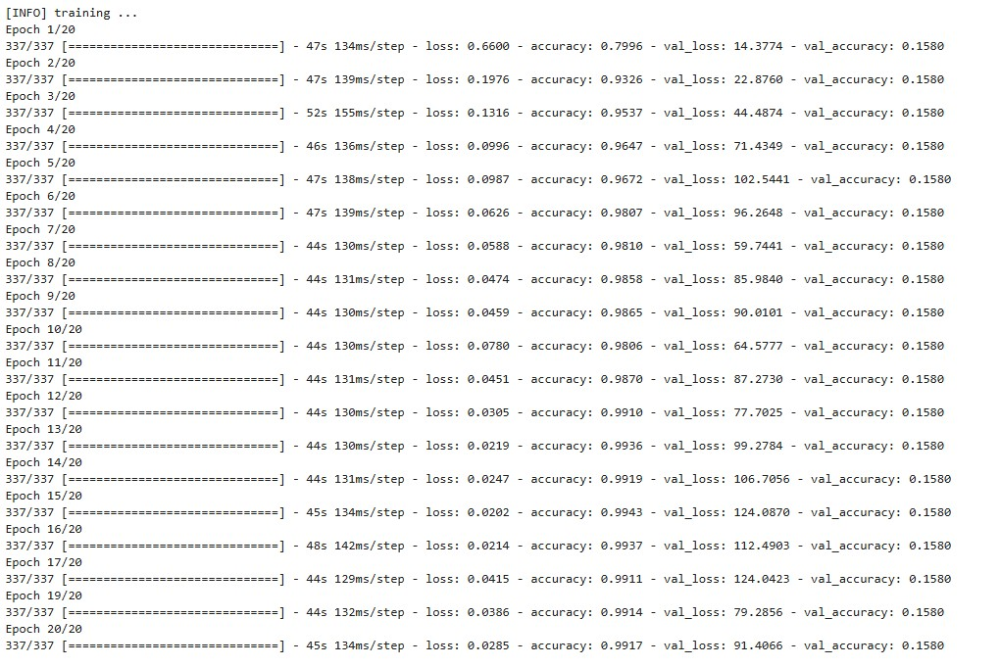

In the training logs provided, there are several key points that can be observed:

1. Training Loss vs Validation Loss:

> During the training process, we can see that the training loss is consistently decreasing, which is expected as the model learns from the training data.

> However, the validation loss is increasing and remains high throughout the epochs (e.g., 17.22 at epoch 1, going up to over 70 in epoch 20). This suggests that the model is not generalizing well to unseen data (the validation data).

2. Training Accuracy vs Validation Accuracy:

> Training accuracy starts high at 79.75% in epoch 1 and increases to 99.76% by epoch 20, indicating the model is learning and becoming increasingly accurate on the training data.

> The validation accuracy, however, is stuck at 15.80% for every epoch. This suggests a serious issue with the model's ability to generalize and perform well on the validation data.

3. Possible Causes of Issues:

- Overfitting: The most likely cause for the increasing training accuracy and the stagnant validation accuracy is overfitting. Overfitting occurs when the model learns the details and noise in the training data to the extent that it negatively impacts the performance of the model on new data (validation data).

> High validation loss and low validation accuracy indicate that the model is fitting the training data well but failing to generalize to the validation set.

4. Possible Reasons for the Observed Behavior:

- Model is Too Complex for the Data: The model might be too complex relative to the dataset, leading it to memorize the training data instead of learning generalizable features. If the model is too large or has too many parameters relative to the size of the dataset, it can lead to overfitting.

5. Data Issues:

- Mismatch in training and validation data: If the training data is very different from the validation data, the model could learn specific patterns that don’t generalize. For example, if the validation data distribution is quite different from the training set, or if the validation set is too small or poorly labeled, it can result in poor validation performance.

- Data leakage or improper split: If there’s any overlap between training and validation sets or the data split is not done correctly, the model could be inadvertently learning from the validation set during training.

- Lack of Regularization or Data Augmentation: Techniques like dropout, L2 regularization, or data augmentation (to artificially increase training data variety) can help prevent overfitting. If these techniques aren't applied, the model may learn very specific features from the training data that don’t generalize to unseen data.

- Learning Rate or Optimizer Issues: The learning rate could be too high, causing the model to overshoot the optimal parameters and fail to converge well on the validation set.

5. Steps to Improve the Situation:

- Use Early Stopping: This technique can help stop the training process if the validation loss does not improve after a certain number of epochs. It can prevent overfitting by halting training before the model starts to memorize the data.

- Reduce Model Complexity: If overfitting is suspected, try using a simpler model (with fewer layers/parameters) to reduce the chance of memorizing the data.

- Regularization: Use techniques like dropout or L2 regularization to prevent the model from overfitting.

- Data Augmentation: Apply data augmentation techniques like rotation, flipping, zooming, and cropping to increase the variability in the training data, which can help the model generalize better.

- Learning Rate Adjustment: Consider reducing the learning rate or using a learning rate scheduler to gradually decrease the learning rate as the training progresses.

Ensure Proper Data Split: Verify that the training and validation sets are well-balanced, and that no data leakage occurs between them.

**Conclusion:**

The training logs suggest that third model is overfitting the training data, leading to a very high training accuracy and poor validation accuracy. Overfitting is usually the result of having a complex model, inadequate regularization, or insufficient data. To improve performance on unseen data (validation data), try applying regularization techniques, adjusting the model architecture, and experimenting with data augmentation.

**Evaluation and Accuracy of third Model**

Like other models we will also evaluate third model and predict the model to review the model performance and understand the area of improvement. From training logs we can already find that model is need some improvement and cannot be consider a best model at this stage. 

Let's find analyse the report on evaluation and prediction 

**Overall Metrics:**

- Accuracy: 0.19 (19%)

>> This indicates the overall accuracy of the model. It suggests that the model is very poor at making correct predictions across all classes.

- Macro Average:

>> - Precision: 0.80, Recall: 0.25, F1-score: 0.08

>> - Macro Average Precision: The average precision across all classes is 80%. This seems high, but it's skewed by the 100% precision values in the first three classes (Airplane, Bird, and Drone).

>> - Macro Average Recall: The recall is low at 0.25, meaning that, on average, the model is not detecting most of the true instances across the classes.

>> - Macro Average F1-score: The F1-score is very low at 0.08, indicating that the model is struggling to maintain a balance between precision and recall across the classes.

- Weighted Average:

>> - Precision: 0.85, Recall: 0.19, F1-score: 0.06

>> - Weighted Average Precision: The weighted precision is high due to the perfect precision scores for the first three classes, but it's important to note that the model is failing to capture the majority of the instances.

>> - Weighted Average Recall and F1-score: The low recall and F1-score are driven by the poor performance in detecting true positives across most of the classes.

**Key Issues & Explanation:**

- Class Imbalance: The model is clearly favoring "Helicopter" in the predictions. While it achieves perfect recall for Helicopter, it fails to detect the other classes (Airplane, Bird, Drone). The weighted average precision is high, but the overall model performance is bad.

- Prediction Failure: The model seems to predict "Airplane", "Bird", and "Drone" with 100% precision, but it never actually predicts any true instances of these classes (recall is 0). This might be due to a misalignment between the training and validation data, or a problem in how the model was trained.

**Recommendations:**

- Model Review: Investigate how the model is being trained. It could be an issue with class weights, insufficient training data, or a mismatch in training and validation datasets.

- Data Augmentation/Resampling: We might need to balance the dataset (if it's imbalanced) or apply data augmentation to create more variety in the training set.

- Evaluation Metrics: Ensure that the evaluation metrics (such as recall, precision, and F1-score) are appropriate for the task.We might also need to experiment with different hyperparameters or models.

**Additional Improvement for the third model**

- Improve Model's Sensitivity to Minority Classes
- Improving Model Architecture, in case of pre-trained model like MobileNetV2, we can use fine-tunning layers and freeze the earlier layers and fine-tune the deep layers based on the classification performance for each class.
- Implement K-Fold Cross-Validation to ensure the model's performance is not biased.

In conclusion, while the model is predicting Helicopter well, it is failing drastically with the other classes, making it an ineffective classifier in its current state.

To better understand class weights and class imbalance, as observed in the case of the third model, a confusion matrix can be extremely helpful.In the scope of the project we created confusion matrix to focus on the issue. 

A **confusion matrix** is an essential tool for understanding the performance of a classification model, especially in multiclass classification tasks. It provides a deeper understanding of the model's strengths and weaknesses, helps with identifying class imbalances or misclassifications, and guides further model improvement strategies.

It provides a detailed view of how the model performs across different classes, highlighting misclassifications and giving insight into which classes are underperforming. This can help identify areas where class imbalance may be affecting the model's accuracy and guide adjustments such as applying class weights.

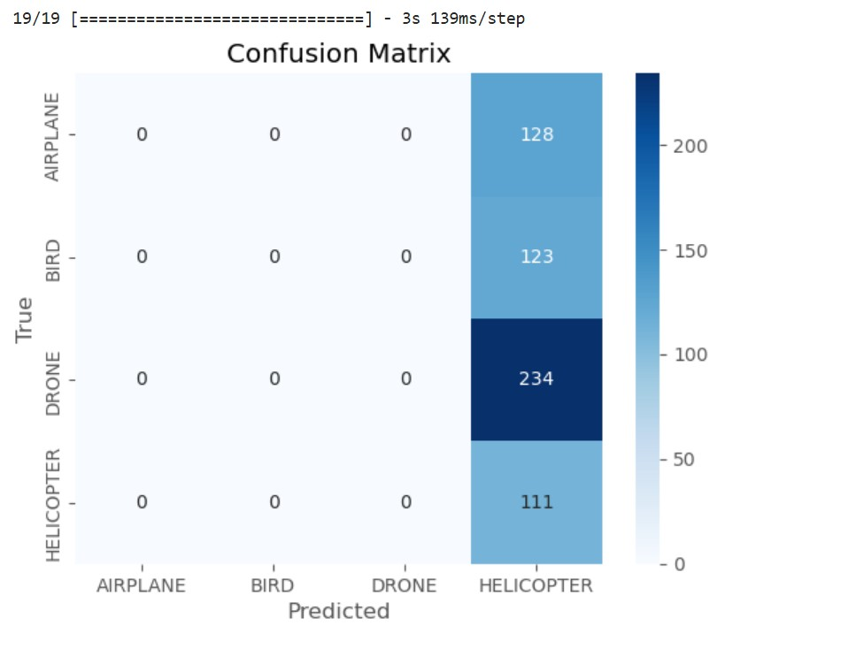

**Overall summary of all three models performance**

let's review the tabular view of all three performance and find the best model for this image classifcation. 

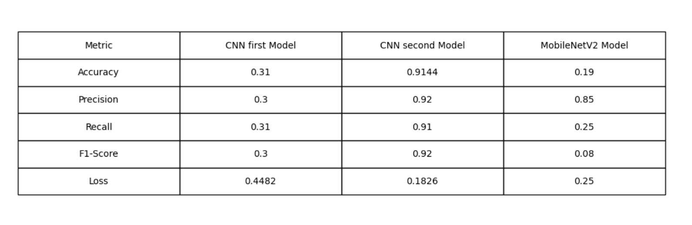

With above evaluation details on all three models used in the scope of this image classification. Let's review the plots created on training and loss accuracy for all three models. 

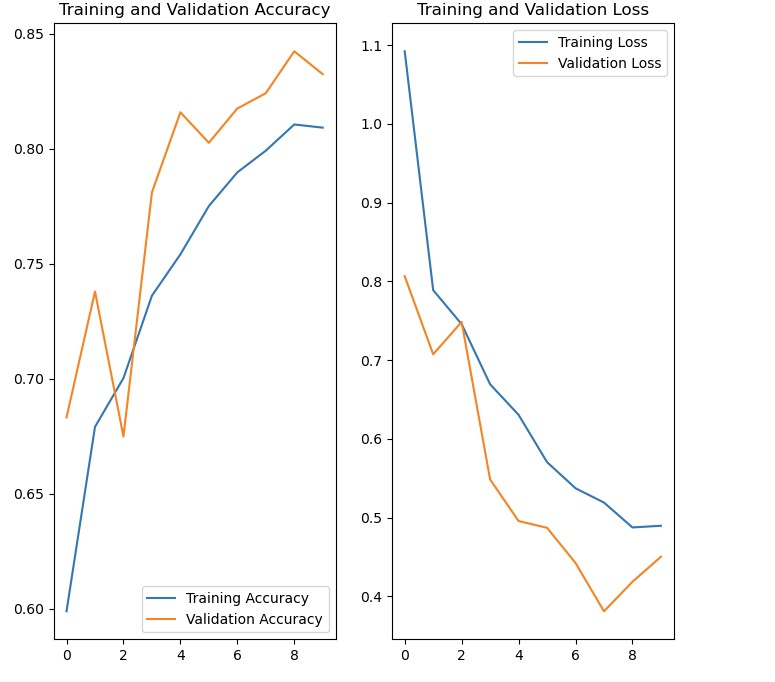

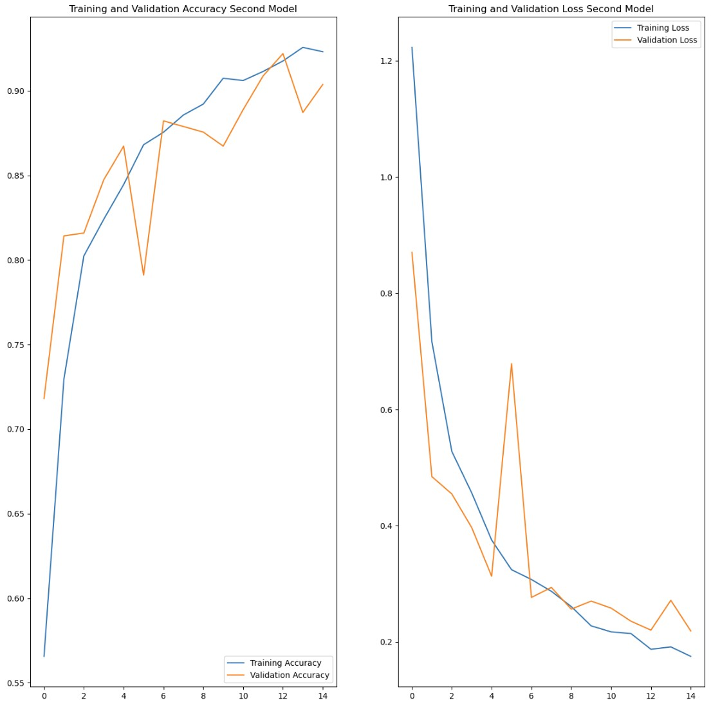

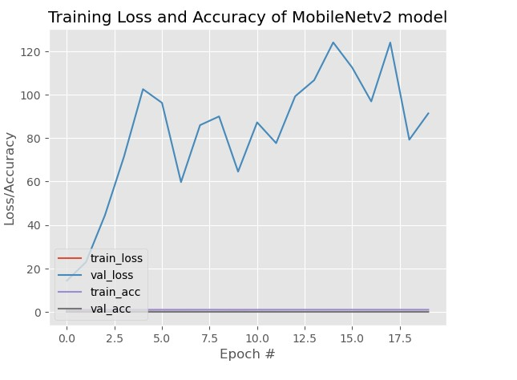

## Project Findings and Conclusion:

From the above comparison, it is evident that the first CNN model requires significant improvement. Its accuracy is relatively low, and the precision and recall values for most classes are also subpar, which indicates that the model is not effectively distinguishing between the different categories. This suggests that the model has not learned robust features to properly classify the images, likely due to issues such as overfitting, insufficient data, or suboptimal hyperparameters. To enhance the model's performance, it would be necessary to explore methods like fine-tuning the model, experimenting with more advanced data augmentation techniques, and adjusting hyperparameters. Additionally, techniques like class weighting or oversampling underrepresented classes in the dataset might help improve the model's ability to generalize better to unseen data.

To address these concerns, the second model was created using the same CNN architecture but with optimized hyperparameters. The goal was to provide a better result by refining the model and training approach. With these changes, we aim to achieve higher accuracy, better precision, and improved recall across all classes compared to the first CNN model. This iterative improvement highlights the importance of tuning various components to get closer to an optimal solution.

On the other hand, the MobileNetV2 model also reveals significant issues with class imbalance and generalization. While it performs well on certain classes in terms of precision, it struggles to generalize across the entire dataset. The model’s inability to correctly identify instances from most of the classes is detrimental to its overall performance, as it leads to a drop in recall and F1-score. Despite being a lightweight and efficient architecture, MobileNetV2 exhibits limited ability to handle the complexity and variance of the dataset in this particular scenario.

Addressing these issues is crucial for improving the accuracy and overall performance of the model. Possible approaches include leveraging more advanced class balancing techniques such as focal loss or class weighting, enhancing the dataset with more diverse examples, and exploring techniques like transfer learning or more complex architectures that can capture the underlying patterns of the data more effectively. Additionally, fine-tuning the MobileNetV2 model on more diverse or balanced data, or experimenting with different hyperparameters, could potentially improve its performance, making it more suitable for the task at hand.

In summary, both models, the first CNN and MobileNetV2, exhibit significant room for improvement. By focusing on enhancing generalization, addressing class imbalance, and optimizing hyperparameters, it’s possible to significantly improve the models’ performance, leading to better accuracy and precision across all classes.

## Future Work and Enhancement of the Project:

We can enhance the project by advancing from image classification to object detection, enabling the model to identify specific objects within an image. This enhancement opens the door to more sophisticated applications, such as real-time tracking, automated surveillance, and targeted analysis, significantly expanding the use cases and capabilities of the system.

For future improvements, several key areas can be explored to further optimize the model's performance and expand its capabilities:

**Comparative Analysis of Classification Techniques:**

One of the primary avenues for improvement is conducting a comparative analysis of different classification algorithms. Exploring alternative machine learning techniques, such as **Support Vector Machines (SVM)** and **K-Means Clustering**, could provide valuable insights into their respective strengths and weaknesses. SVM, for example, excels in high-dimensional spaces and might offer better margin separation for certain datasets, whereas K-Means can be useful for clustering and classifying images based on similarity. By evaluating these approaches alongside the current CNN and MobileNetV2 models, we can determine which algorithm offers the most efficient and accurate performance for drone image classification. This comparison will help identify the most suitable model for various operational environments and further improve accuracy, scalability, and robustness.

**K-fold cross-validation:**

K-fold cross-validation helps in improving the generalization, reliability, and efficiency of an image classification model. By evaluating performance across different subsets of data, it provides a more accurate measure of how well the model will perform on unseen data, ultimately leading to better model selection, tuning, and deployment.

**Data Augmentation:**

To further improve the model's generalization and overall performance, it is essential to delve deeper into data augmentation techniques. By employing methods such as rotation, scaling, flipping, and cropping, we can artificially expand the dataset, enabling the model to learn from a broader range of perspectives and conditions. Introducing variations in the input images—such as alterations in orientation, size, and lighting—enhances the model's robustness and reduces its susceptibility to overfitting. This diversity within the dataset equips the model to handle real-world variations more effectively, such as those caused by different drone models, changing environmental factors, or varying camera angles. Data augmentation not only diversifies the dataset but also significantly improves the model's ability to generalize to new, unseen data, resulting in superior performance across a wide array of real-world scenarios.

**Model Enhancements:**

Advanced deep learning architectures can further boost the model's accuracy and efficiency. Exploring state-of-the-art architectures like YOLO (You Only Look Once) and Faster R-CNN may lead to significant improvements in both classification performance and inference speed. These models are designed to handle real-time object detection tasks efficiently and are particularly suitable for applications where speed and accuracy are paramount. **YOLO**, for example, performs detection in a single pass, making it one of the fastest and most efficient models for real-time applications. Faster R-CNN, on the other hand, can provide even more accurate region proposals for detecting objects, which could significantly enhance the detection of drones in complex environments.

Another approach for enhancing the model is to leverage pre-trained models like VGG16. VGG16, a deep convolutional neural network architecture, has demonstrated exceptional feature extraction capabilities, especially when fine-tuned for specific tasks. Using VGG16 pre-trained on the ImageNet dataset, followed by fine-tuning for image classification or drone detection, can drastically reduce training time while maintaining or even improving model performance. The rich feature representations learned by VGG16 can help the model identify complex patterns in drone images more effectively, leading to better classification accuracy.

**Real-time Detection:**

A significant next step is extending the model for real-time drone detection in live surveillance footage. Real-time detection adds a layer of complexity, as the model must be able to process and classify images at high speed while maintaining high accuracy. Optimizing the model for inference speed is crucial in scenarios such as live surveillance systems where quick response times are required. Integrating the model with efficient video processing frameworks—such as TensorFlow Lite, OpenCV, or other lightweight solutions—can help optimize the model for real-time deployment. Additionally, by streamlining the model’s architecture and reducing computational complexity, we can improve its ability to make predictions swiftly without sacrificing accuracy. Real-time drone detection has the potential to significantly enhance security and surveillance systems, enabling prompt identification of unauthorized drones in restricted airspace or sensitive areas. This integration would enable more effective and timely interventions, improving overall safety and security.

**Model Deployment for Commerical use**

Deploying an image classification model for commercial use is a complex, multi-faceted process that encompasses more than just the technical aspects of model optimization and deployment. It requires a strategic alignment with business objectives, seamless integration into existing workflows, and a focus on user experience, security, and scalability. By ensuring that the model is fully integrated into business operations, continuously monitored for performance, and optimized for both cost and efficiency, the deployment can provide significant value and drive business outcomes. Moreover, establishing a robust system for ongoing model improvements, monitoring, and retraining ensures the model remains adaptable and effective as business requirements and data evolve over time.

## Reference to Jupyter Notebook and steps to run the file

Before running the script please replace the content of data folder to the kaggle dataset link attached in the section **Source Dataset and Insights on data** in the begining of the page. 

The content of data folder in the project repository here is restructured after running the notebook. So to use some varaible we need to use the original dataset of kaggel before running the jupyter notebook. 

The model execution time is high so prefer to run on GPU to avoid crashing the kernel in anaconda. 

Some packages are required to be install on anaconda environment to import. For example - tensorflow, sklearn, matplotlib etc. 

Reference to Jupyter Notebook file : https://github.com/PoojaSinha8809/Practical-Assignment-Module-11/blob/main/prompt_II.ipynb

